# Whyline

**Know why your AI wrote every line, and clean up what it left behind.**

`git blame` tells you who. Whyline tells you why.

Whyline saves the request behind every line IBM Bob writes, right in your git history, and tells you when its temporary code is safe to delete. It works with [IBM Bob](https://bob.ibm.com), IBM's AI coding assistant.

**Website:** https://sal-sovereign-ai-labs.github.io/whyline/ (the story in one page, with the live diagrams)

**Before:** `git blame` says who and when.

```
$ git blame -L 3,3 src/payments/mock_gateway.py
68573049 (demo 2026-09-27 14:17:00 +0500 3)     def charge(self, total):
```

**With Whyline:** you also get why, and whether it can go.

```
$ whyline why src/payments/mock_gateway.py:3
src/payments/mock_gateway.py:3
written by     AI (IBM Bob)
asked by       demo, on 2026-09-27, in Bob chat a1c3e5f7
request        "Add a mock payment gateway in src/payments/mock_gateway.py with a class MockGateway whose charge(total) returns True, so the checkout demo works until payments-v2 lands. Make checkout() call MockGateway().charge(...) before returning the total."
other files this request changed
               src/payments/checkout.py:2
               src/payments/checkout.py:6-8
temporary code mock, ready to delete: nothing uses MockGateway any more (id L-12d3fa)
commit         6857304
Next: tell Bob "remove mock_gateway.py" and it shows the proof and asks before deleting.
```

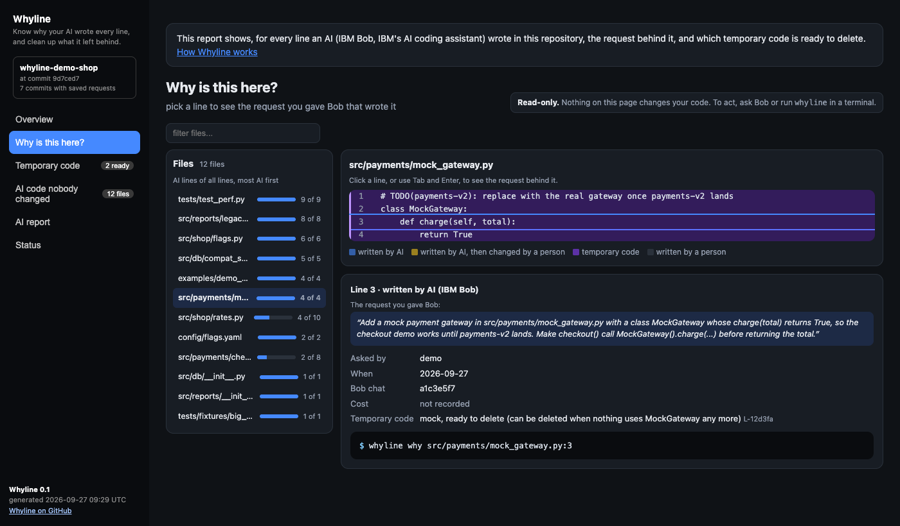

## You have this problem if

- Your AI assistant writes a big share of your code, and the request behind a change is gone once the chat is closed.
- You found a mock, a demo script or a feature flag in production, and nobody knew whether it could go.
- A reviewer asked why a function exists, and the only answer was "the AI wrote it".
- Your lead asks how much of this release was written by AI, and how much of it anyone actually changed.

## Try it in a minute

```sh
npm install -g @sal-sovereign-ai-labs/whyline
cd your-repo
whyline init                  # adds the small scripts Bob runs automatically, and the git hooks
git add .bob && git commit -m "add whyline"
```

Then work in Bob as usual. There is nothing new to type.

No Bob at hand? Look at a repository that already has it: [whyline-demo-shop](https://github.com/SAL-Sovereign-AI-Labs/whyline-demo-shop), or the [live report](https://sal-sovereign-ai-labs.github.io/whyline/report/) built from it.

## How it works

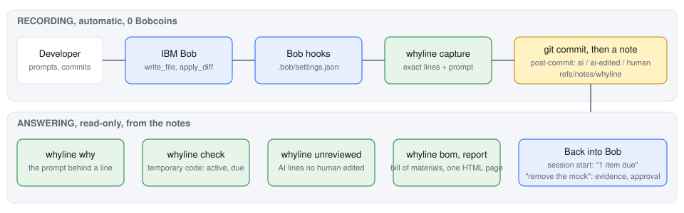

1. **You ask Bob for something.** For example: "add a mock payment gateway so checkout works until payments-v2 lands".
2. **Bob writes the code, and Whyline saves your request with those exact lines.** Small scripts that Bob runs automatically do this. They never call an AI, so they cost nothing and add about 0.2 seconds per file Bob edits.
3. **You commit.** Whyline saves the record in your git history as a git note: extra data attached to the commit. Your files are not touched. Each line is marked as written by AI, written by AI then changed by a person, or written by a person.
4. **Whyline notices temporary code.** Mocks, demo scripts, feature flags, workarounds, anything asked for "until" something. It remembers when each one should go: after a date, or once nothing uses it any more.
5. **When it is ready to delete, Bob does the cleanup, with your yes.** Ask Bob "remove the mock payment gateway". Bob shows the proof that nothing uses it and that the tests pass, asks you, and deletes it only after you say yes. A pull request check can also fail while expired temporary code is still there.

Bob cannot edit the history Whyline keeps: a check blocks any Bob command that would rewrite or delete it.

## What you can ask

| You want to know | Ask Bob | Or run |
|---|---|---|
| Why is this line here? | "why does line 3 of mock_gateway.py exist?" | `whyline why src/payments/mock_gateway.py:3` |
| What can I delete? | "what temporary code can I delete?" | `whyline check` |
| What did the AI write that nobody changed? | "what AI code has nobody changed?" | `whyline unreviewed` |
| How much of this release is AI? | "give me the AI report for this release" | `whyline bom` |
| Keep something on purpose | "keep the beta flag until the Q1 review" | `whyline keep flags.yaml "beta flag stays until Q1 review"` |

`whyline report` writes one offline page with all of it, like the [live report](https://sal-sovereign-ai-labs.github.io/whyline/report/), and refreshes it after every commit.

## Good to know

- **Squash merges drop the history.** A squash merge makes a new commit without the git notes of the commits it squashed. Keep merge commits, or copy the notes onto the squash commit (`git notes --ref whyline copy <old> <new>`). Amend and rebase keep the notes.
- **The history travels with your code.** The installed git hooks push and fetch Whyline's notes with your branches. A copy of the repository without them has no history.
- **It starts at `whyline init`.** Code written before that shows as written by a person. `whyline seed` finds temporary-looking code from before (TODO remove, FIXME, HACK, "until" comments) and starts tracking it, but it cannot know who wrote it.
- **"Nothing uses it" is a text search.** Code reached only through strings or reflection can look unused. That is why Bob always shows the proof and waits for your yes before deleting.
- **Only Bob's file edits are recorded.** If Bob changes a file with a terminal command (`sed`, `rm`), that change is not recorded as AI-written.

What Whyline does not claim:

- A saved request shows what was asked, not that the code is correct. Whyline does not grade code or tests.
- The history is a record, not a tamper-proof ledger. Bob cannot edit it, but a person with write access to the repository can.

## Under the hood

For the curious: the moving parts, with the real file and event names. Each clip plays one step and loops. To click through the steps yourself at 0.5×, 1× or 2× speed, run the interactive version in [architecture/](architecture/).

### 1. In your editor

**Saving the request.** You ask Bob for a cart helper. The scripts Bob runs automatically save your request and the exact lines Bob wrote. No AI model runs, so it costs no Bob usage credits.

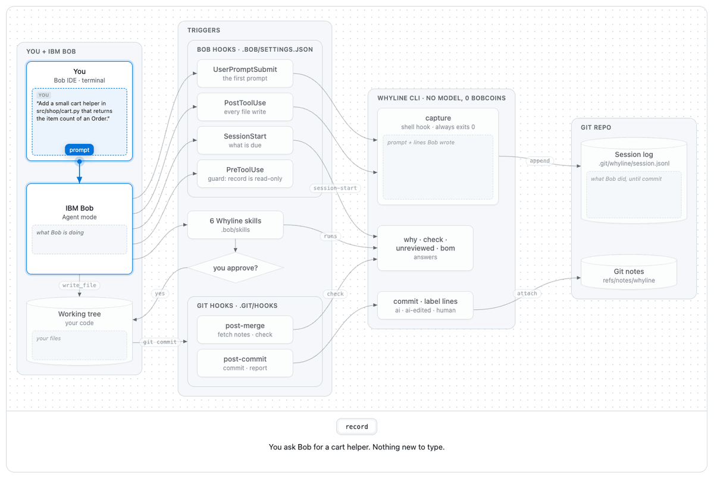

**The commit.** A git hook labels every line (written by AI, written by AI then changed by a person, or yours) and attaches the history to the commit as a git note, extra data on the commit. Your files are not touched.

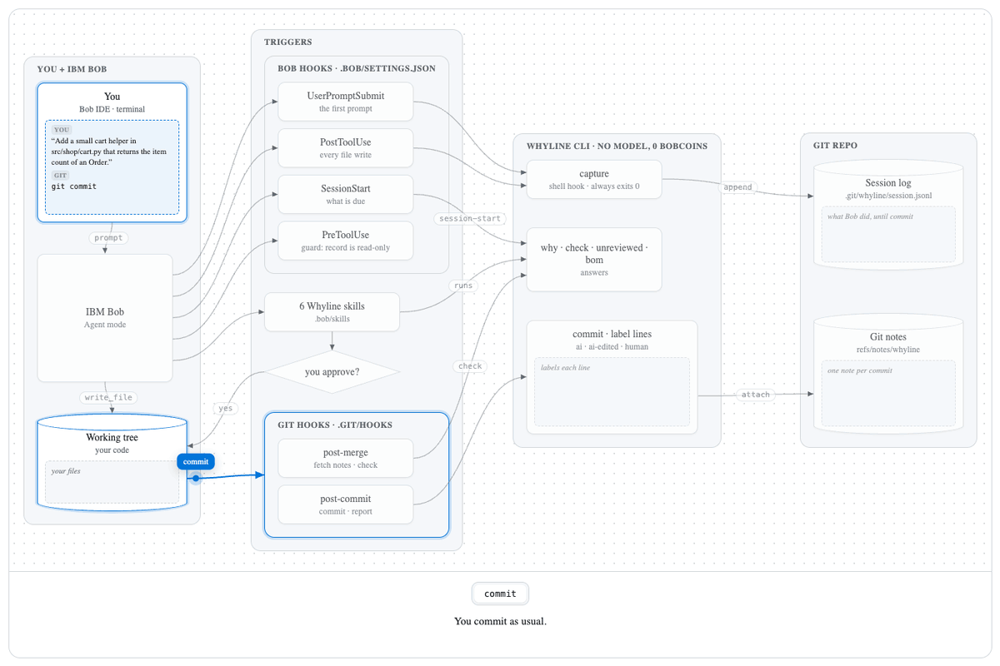

**Asking why.** You ask why a line exists. `whyline why` finds the commit with `git blame`, reads its note and answers with the request that wrote the line.

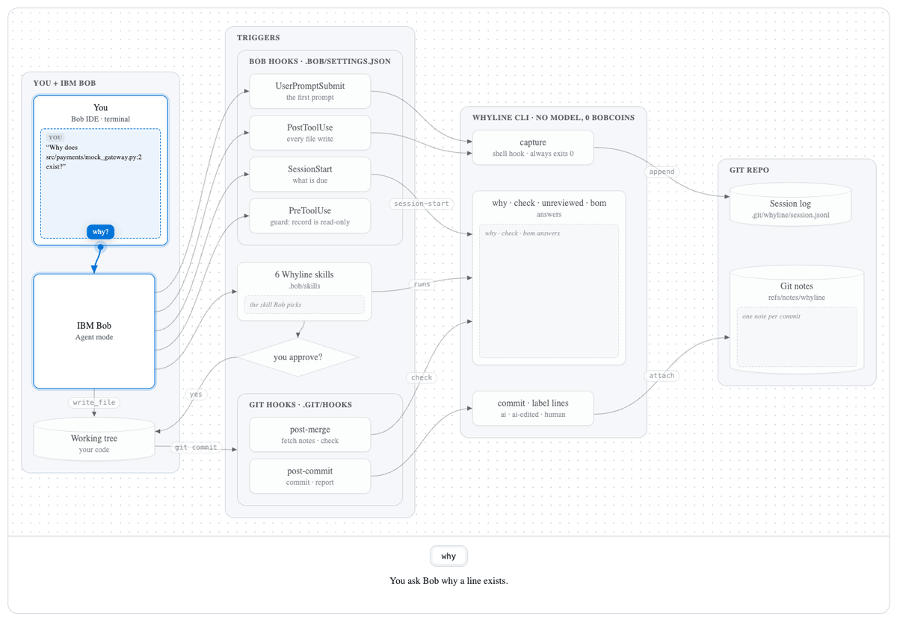

**Expiry.** payments-v2 is merged. Nothing uses the mock gateway any more, so `whyline check` marks it ready to delete. Bob cannot edit the history Whyline keeps.

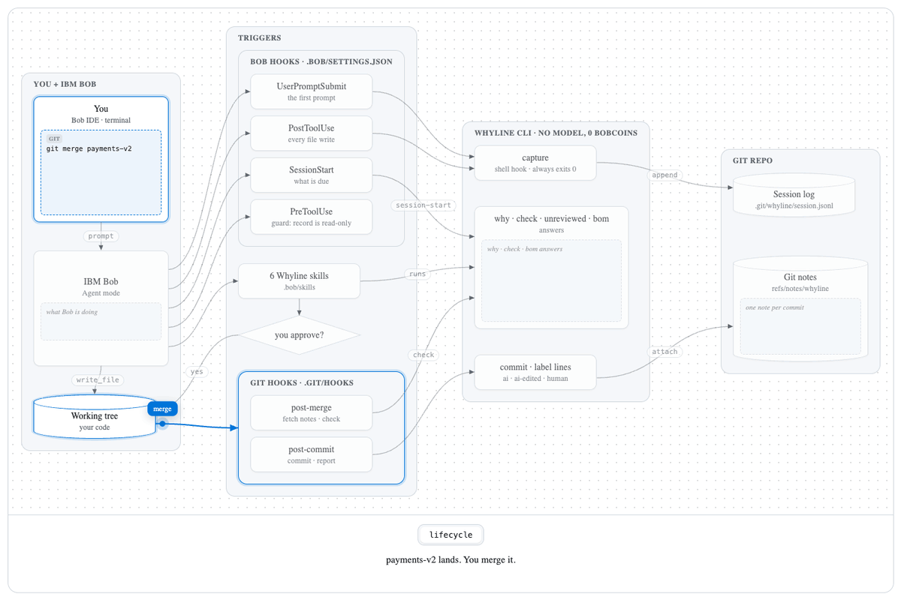

**Deleting it.** You ask Bob to remove the mock. Bob shows the proof it is safe to delete, runs the tests and waits for your yes. The deletion is saved in the history too.

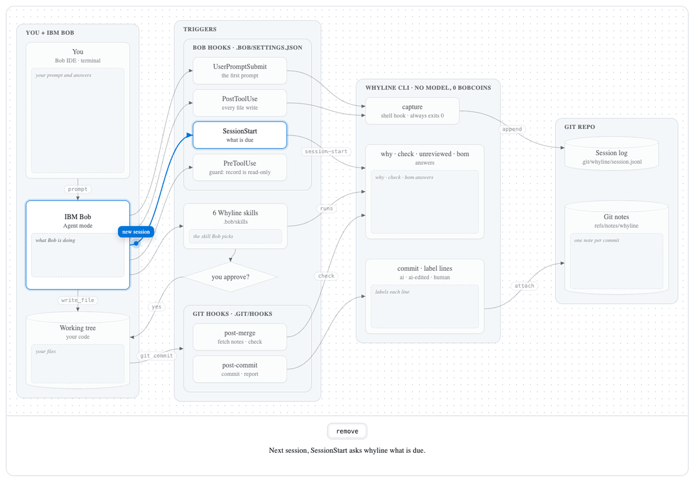

### 2. Across the team

**Sharing.** The history travels with your code: a git hook pushes it with your branch, and pulling fetches it.

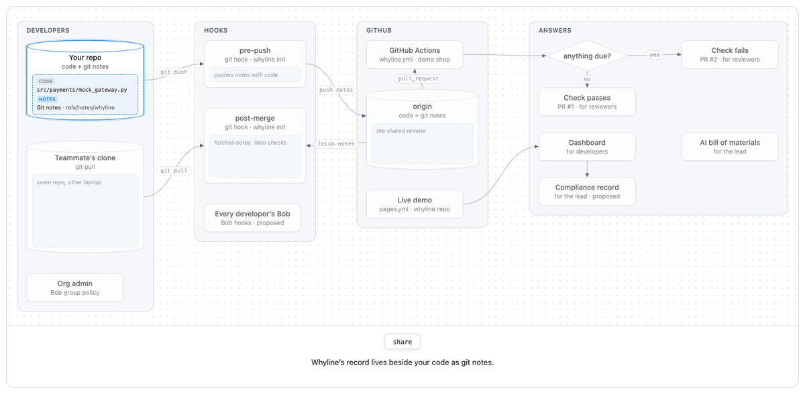

**The pull request check.** GitHub Actions fails the pull request check while temporary code that is ready to delete is still there. On the demo shop, [PR 1](https://github.com/SAL-Sovereign-AI-Labs/whyline-demo-shop/pull/1) passes and [PR 2](https://github.com/SAL-Sovereign-AI-Labs/whyline-demo-shop/pull/2) fails.

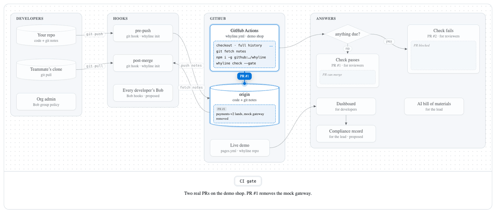

**The report page.** One page answers each role: why each line exists, what is ready to delete, which AI code no person has changed since, and the AI report for a release.

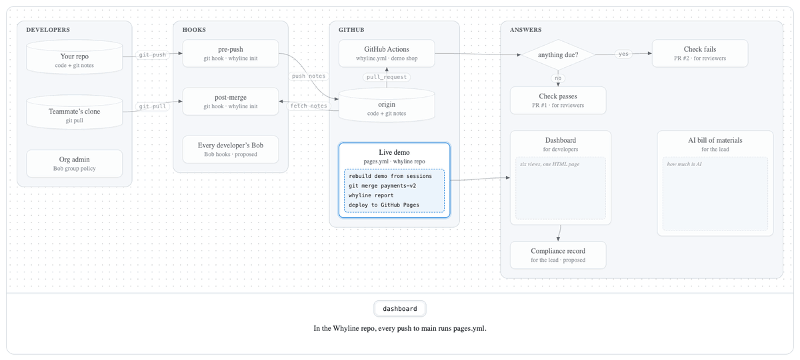

**A Team plan (proposed, not built).** A paid plan would turn Whyline on for every developer through Bob's organisation settings, and keep each release's report.

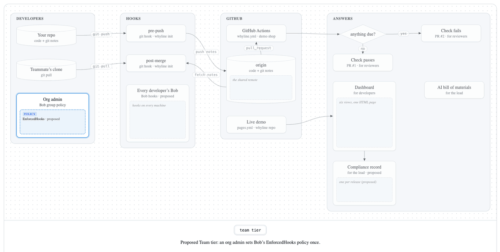

## Everything the CLI does

| Command | What it does | Exit code |
|---|---|---|
| `whyline init` | set up Whyline in the current repository (Bob scripts and git hooks) | 0, 3 if not a git repository |
| `whyline why <file>:<line> [--json]` | who wrote this line, the request behind it, other files the same request changed, and whether it is temporary code | 0 |
| `whyline check [--json] [--gate]` | temporary code: waiting, ready to delete, kept on purpose, deleted | 0; with `--gate`, 2 while anything is ready to delete (for pull request checks) |
| `whyline unreviewed [--json]` | AI code no person has changed since, per file, with test coverage if you have a report | 0 |
| `whyline bom [A..B] [--json]` | AI report for a release: lines changed, AI lines, lines a person changed, temporary code shipped | 0 |
| `whyline report [--out file]` | one offline page with every answer | 0 |
| `whyline keep <file> "<reason>"` | keep temporary code on purpose | 0 |
| `whyline until <file> <YYYY-MM-DD>` | give temporary code a date to go | 0 |
| `whyline watch <file> --symbol Name` | set which class or function name counts as a use | 0 |
| `whyline removed <file>` | record a deletion you did by hand (a commit message naming the file does this too) | 0 |
| `whyline seed [--dry-run] [--by-name]` | on an existing repository, start tracking temporary-looking code written before Whyline | 0 |
| `whyline selftest` | built-in self check: plants a passing and a failing case for every check in a throwaway repository | 0 |
| `whyline capture`, `session-start`, `commit` | run automatically by Bob and git; you never type them | 0 |

`--json` prints machine-readable output. `WHYLINE_DEBUG=1` prints stack traces.

## Speed

Measured with `npm run bench` on a MacBook Pro (Apple M1 Pro, Node 26), median of 10 runs, 27 Sep 2026: saving a request with Bob's edit 182 ms, `why` 311 ms, `check` 347 ms, `unreviewed` 638 ms, the note at the start of a Bob chat 958 ms, `bom` 1.3 s, `report` 2.9 s (runs in the background after a commit).

## Private by design

Whyline makes no network calls. Your requests are stored as you typed them, in your own repository, and travel only where your code travels. Do not paste secrets into requests. The generated report page also contains the requests, and `whyline init` keeps it out of your commits.

## Troubleshooting

| Symptom | Do this |
|---|---|
| `whyline why` says git blame failed | The file is not tracked, or you are in another repository. `git ls-files <file>`. |
| `check` says there is no temporary code yet | Nothing Bob wrote has been committed since you installed. Commit once, then `whyline check`. |
| Nothing is saved after a commit | `whyline` is not on the PATH for git hooks (`npm link`), or `whyline init` was not run. See `.git/whyline/hook.err`. |
| Bob does not record anything | Bob skips scripts in untrusted folders: trust the workspace. Make sure `.bob/settings.json` is committed, then `whyline init` again. |
| Cost is not recorded | Bob IDE keeps task cost in a different place than Bob Shell, or sqlite3 is missing. Everything else is saved. |

## Uninstall

Delete `.bob/hooks/whyline.sh`, `.bob/hooks/whyline-guard.sh`, the whyline lines in `.bob/settings.json`, and the whyline lines in `.git/hooks/post-commit`, `post-merge` and `pre-push`. Bob and git keep working. The saved history stays in the repository as git notes until you delete it with `git update-ref -d refs/notes/whyline`.

## Requirements

Node 20 or newer and git. IBM Bob IDE 2.2 or Bob Shell 2.x. macOS and Linux are tested in CI. Windows needs Git Bash and is untested.

## Development

```sh
npm test            # 82 tests on throwaway git repositories
npm run smoke
npm run bench
```

How Whyline talks: [docs/VOICE.md](docs/VOICE.md). Architecture and data format: [docs/05-architecture.md](docs/05-architecture.md). Adding another AI assistant: [docs/08-adapters.md](docs/08-adapters.md).

## Built for the IBM Bob hackathon

Whyline was built for the IBM Bob 2.0 hackathon (25 to 27 Sep 2026). For judges:

| What you want to see | Where |
|---|---|
| The website: the idea, the story and the live diagrams in one page | https://sal-sovereign-ai-labs.github.io/whyline/ |
| The live report (the demo shop after payments-v2 merged, rebuilt by CI, no login) | https://sal-sovereign-ai-labs.github.io/whyline/report/ |
| A pull request check passing and failing on a real repository | [whyline-demo-shop](https://github.com/SAL-Sovereign-AI-Labs/whyline-demo-shop): [PR 1, the mock is deleted](https://github.com/SAL-Sovereign-AI-Labs/whyline-demo-shop/pull/1) and [its check passing](https://github.com/SAL-Sovereign-AI-Labs/whyline-demo-shop/actions/runs/36303214774); [PR 2, the mock is left behind](https://github.com/SAL-Sovereign-AI-Labs/whyline-demo-shop/pull/2) and [its check failing on the file](https://github.com/SAL-Sovereign-AI-Labs/whyline-demo-shop/actions/runs/36303836900) |
| The package | `npm install -g @sal-sovereign-ai-labs/whyline` ([npm](https://www.npmjs.com/package/@sal-sovereign-ai-labs/whyline)) |
| What `whyline init` adds to a repository | [.bob/settings.json](.bob/settings.json) (4 Bob scripts), [.bob/skills/](.bob/skills/) (6 instruction files that let you ask Bob in plain English) |
| Bob building and using Whyline | [bob_sessions/](bob_sessions/) (task screenshots), [bob_sessions/costs.md](bob_sessions/costs.md) (41.46 Bob usage credits) |
| Tests and CI | [cli/test/](cli/test/) (82 tests), [Actions](https://github.com/SAL-Sovereign-AI-Labs/whyline/actions) |

### Check it yourself

Every value below comes from running the command. Build the sample repository first: `git clone https://github.com/SAL-Sovereign-AI-Labs/whyline && cd whyline && node demo/build.js /tmp/shop` (with whyline installed from npm).

| Claim | Run | You should see |
|---|---|---|
| 82 tests, zero dependencies | `npm test` and `node -e "console.log(Object.keys(require('./package.json').dependencies \|\| {}).length)"` | `pass 82`, `fail 0`, and `0` |
| Every AI line keeps its request | `cd /tmp/shop && whyline why src/payments/mock_gateway.py:3` | `written by AI (IBM Bob)` and the request that wrote it |
| The history lives in git | `git notes --ref=whyline list \| wc -l` | 7, one per commit Bob wrote in |
| Temporary code gets a date to go | `git merge payments-v2 && whyline check` | `READY TO DELETE`, `src/payments/mock_gateway.py`, `nothing uses MockGateway any more` |
| It can fail a pull request | `whyline check --gate; echo $?` | `2` while anything is ready to delete |
| Every check can fail | `whyline selftest` | `5 of 5 checks told the two cases apart. Whyline works on this machine.` |
| It is published | `npm view @sal-sovereign-ai-labs/whyline version` | `0.1.1` |

### How Whyline uses IBM Bob

| Bob 2.0 feature | What Whyline does with it | Where | Uses the AI? |
|---|---|---|---|
| Hooks (small scripts Bob runs automatically): when you send a request (UserPromptSubmit), after Bob edits a file (PostToolUse), when a Bob chat starts (SessionStart) | Save each request and the exact lines Bob wrote; tell Bob at the start of a chat what is ready to delete | [.bob/settings.json](.bob/settings.json), [cli/lib/capture.js](cli/lib/capture.js) | No |
| Hook before Bob runs a command (PreToolUse, exit 2 blocks) | Bob cannot rewrite or delete the history Whyline keeps | [.bob/hooks/whyline-guard.sh](.bob/hooks/whyline-guard.sh) | No |
| Skills (6): why, check, decide, remove, status, setup | Answer plain questions in Agent mode by running the whyline command and quoting its output | [.bob/skills/](.bob/skills/) | Bob words the answer |
| Agent mode and Bob's approval prompt | Deleting temporary code: proof, a dry run, your yes, then Bob deletes and commits | [.bob/skills/whyline-remove/SKILL.md](.bob/skills/whyline-remove/SKILL.md) | Yes, and only this step changes code |
| Bob's task database | Each saved record includes what that Bob task cost, read only | [cli/lib/agents/bob/index.js](cli/lib/agents/bob/index.js) | No |

Bob also helped build Whyline: 19 Bob IDE tasks across two developers, 41.46 Bob usage credits, with task summaries in [bob_sessions/](bob_sessions/). Bob used Whyline on Whyline's own repository and reported five issues; three became fixes. The rest of the code, tests and docs were written by the team with other tools.

### Business model

| | What | Who pays |
|---|---|---|
| Free | The CLI, the Bob instruction files and the report, MIT licensed, on npm | Nobody |
| Team | Whyline turned on for every developer through Bob's company-wide settings (EnforcedHooks), one report across all repositories, and the report kept as a compliance record per release. For example, $20 per repository per month | The engineering lead who signs off releases, in regulated teams (fintech, health, public sector) |
| Bob | Each developer's own Bob seat. Whyline itself adds no Bob usage cost | The team, as today |

## License

MIT
